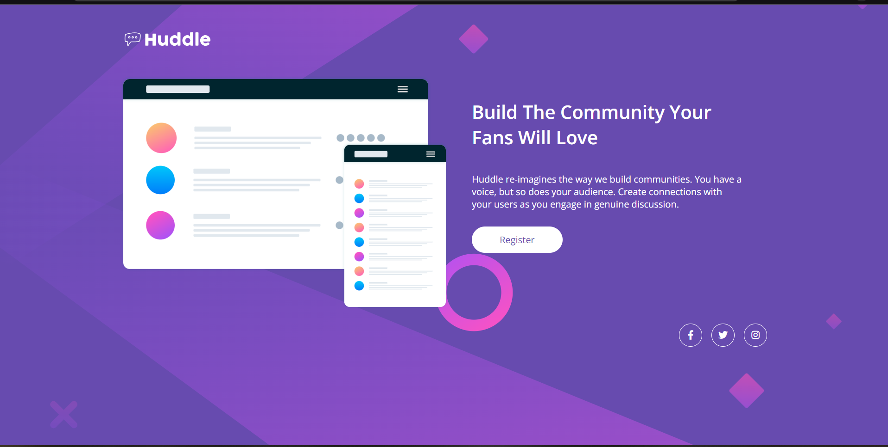
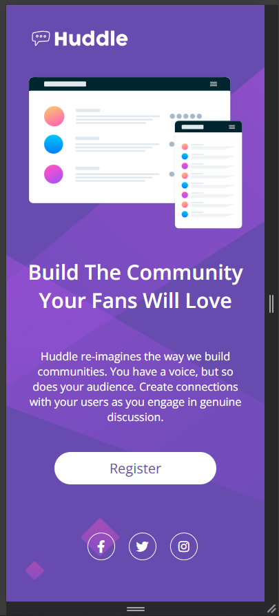

<h1>Projeto Huddle do Frontend Mentor</h1>

O projeto conta com a seguinte estrutura:
<ol>
<li>Header - onde dentro deste header possui uma imagem logo;</li>
<li>Main - dentro do main possui uma imagem e uma div que tem um título e uma breve descrição do que e o huddle e logo a baixo destas informações possui um botão para se registrar;</li>
<li>Footer - o footer e onde possui as redes sociais do huddle;</li>
</ol>

<h2>O projeto conta com a versão desktop e a versão mobile</h2>

Segue a imagem do design desktop proposto pelo desafio

Este foi o resultado obtido

Segue a imagem do design desktop proposto pelo desafio

Este foi o resultado obtido

<h3>Tecnologias utilizadas</h3>
<ul>
<li>HTML</li>
<li>CSS</li>
</ul>